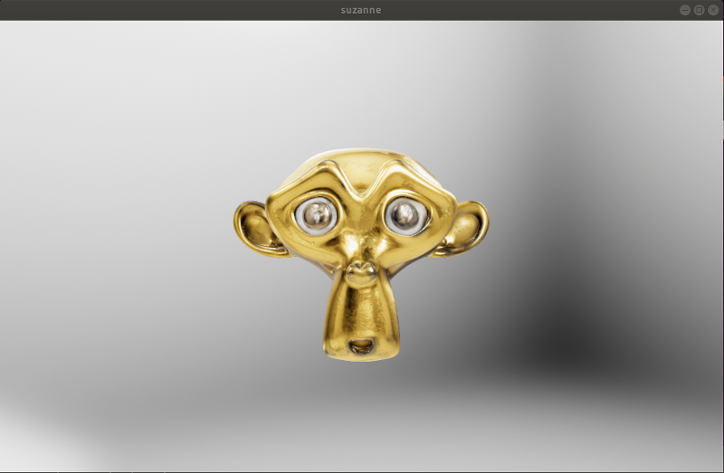
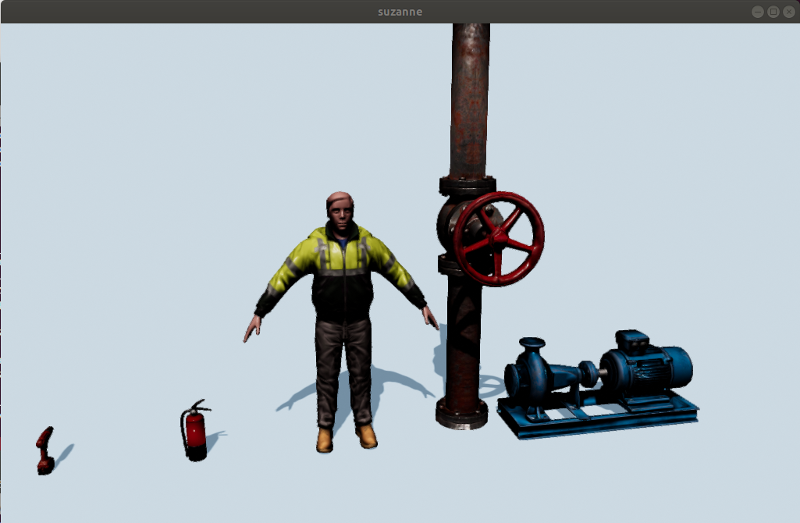

# Filament playground!

A place to play with Google Filament.

## Filament installation

Clone the Filament repository:

```
mkdir -p ~/workspace && cd ~/workspace
git clone https://github.com/google/filament.git
cd filament
git checkout v1.8.1
```

Install the Filament dependencies:

```
sudo apt-get install clang-7 libglu1-mesa-dev libc++-7-dev libc++abi-7-dev ninja-build libxi-dev
```

Compile Filament:

```
./build.sh release
```

Testing:

```
./out/cmake-release/samples/suzanne
```



References:
  * [Building Filament](https://github.com/google/filament/blob/main/BUILDING.md)

## Creating a custom scene

First, we'll need to copy some model assets. Clone this repository:


```
cd ~/workspace
git clone https://github.com/osrf/filament_playground.git
cd filament_playground
```

Add the new model assets to Filament:

```
cp -r assets/* ~/workspace/filament/assets/
```

Copy our modified `suzanne` example and `CMakeLists.txt`:

```
cp samples/* ~/workspace/filament/samples/
```

Now, let's compile the `suzanne` example:

```
cd ~/workspace/filament
./build.sh release suzanne
```

And now you can run it:

```
./out/cmake-release/samples/suzanne
```



### Note about meshes

As far as I see the only mesh formats supported are `obj` and `fbx`. These
formats are supported by a tool named `filamesh`, which seems to convert from
a few mesh formats to a binary representation used in Filament.

See [filamesh README.md](https://github.com/google/filament/tree/main/tools/filamesh). See also [this related issue](https://github.com/google/filament/issues/2634).


## Other resources

[External example](https://github.com/cgmb/hello-filament/blob/master/CMakeLists.txt) showing how to link your demo against Filament.